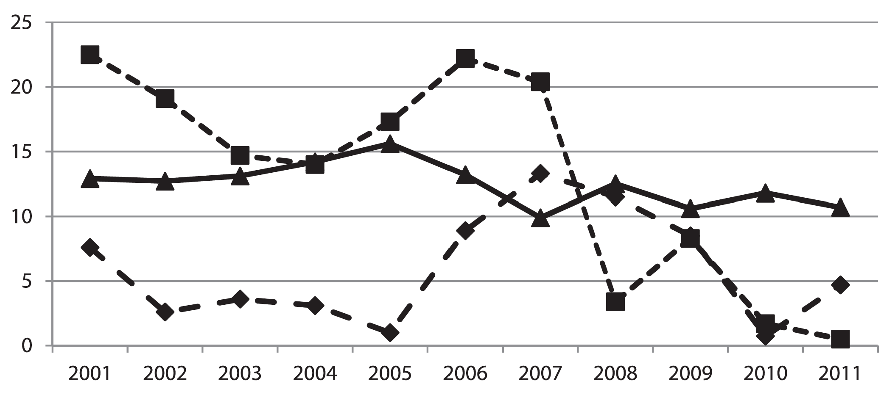
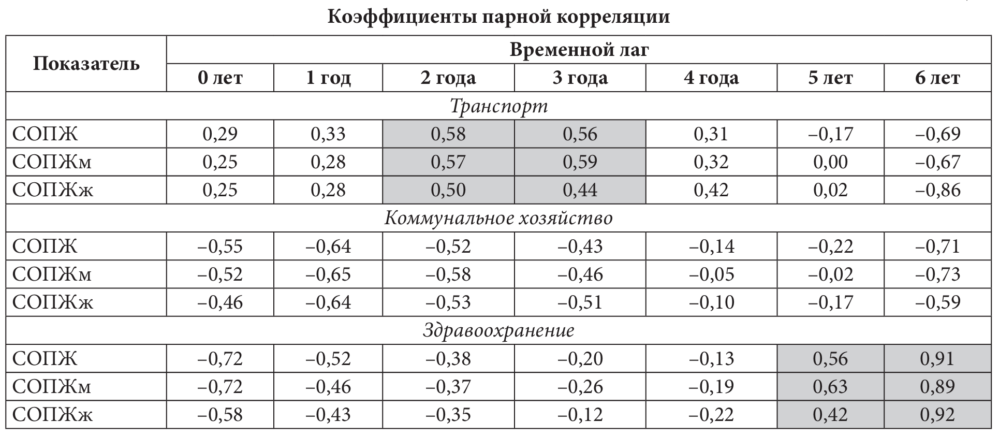

**Ссылка на репозиторий проекта:** [https://github.com/SHAITAN228/Rstudio.git](https://github.com/SHAITAN228/Rstudio.git)

# Введение

В данной работе рассматривается 2 вида анализа данных:

1. **Разведочный анализ данных** (Exploratory Data Analysis).
2. **Причинно-следственный анализ данных** (Causal Analysis).

# Постановка задачи

Необходимо представить научные статьи, в которых используется указанные виды анализа данных, а также обосновать их применение в исследованиях.


# Научные статьи

## Разведочный анализ данных:

### Особенности:

- Изучает как могут быть связаны различные переменные.

- Полезен для обнаружения новых связей.

- Помогает сформулировать гипотезы и управлять планированием будущих исследований и сбора данных.

### Наименование статьи:

[Методический подход к оценке Влияния бюджетных расходов на 
среднюю ожидаемую продолжительность жизни населения (на 
примере г. Екатеринбурга).](https://cyberleninka.ru/article/n/metodicheskiy-podhod-k-otsenke-vliyaniya-byudzhetnyh-rashodov-na-srednyuyu-ozhidaemuyu-prodolzhitelnost-zhizni-naseleniya-na-primere-g)

### Основная цель статьи:

Статья посвящена исследованию зависимости продолжительности жизни населения от бюджетных расходов на инфраструктуру. В статье используются регрессионные модели для количественной оценки влияния государственных инвестиций в критическую инфраструктуру на показатель СОПЖ. 

### Обоснование:

В статье присутствуют признаки анализа данных, одним из которых является первичное исследование исходных данных и визуализация для выявления потенциальных взаимосвязей признаков.

На представленном ниже графике отображена динамика расходов бюджета Екатеринбурга на развитие критической инфраструктуры за период 2001-2011 годов, что позволяет выявить тенденции и закономерности в распределении финансовых средств.


```{r Inv_graph, fig.cap="Динамика бюджетных расходов на критическую инфраструктуру г. Екатеринбурга (2001-2011 гг.)", echo=FALSE, fig.width=6, fig.height=4, out.width="80%", fig.align='center'}

```


В таблице ниже представлены данные о средней ожидаемой продолжительности жизни (СОПЖ) - целевой переменной в исследовании. Данная статистика за одиннадцатилетний период позволяет оценить динамику и выявить общие тенденции.

```{r lifetime_table, echo=FALSE}

table_data <- data.frame(
  check.names = FALSE,  
  `Категория населения` = c("Оба пола (СОПЖ)", "Мужчины (СОПЖм)", "Женщины (СОПЖж)"),
  `2001` = c(66.1, 59.0, 72.4),
  `2002` = c(65.0, 58.8, 72.3),
  `2003` = c(65.6, 58.6, 72.5),
  `2004` = c(65.9, 58.9, 72.9),
  `2005` = c(65.95, 59.0, 73.6),
  `2006` = c(67.2, 61.4, 73.9),
  `2007` = c(68.6, 61.9, 74.4),
  `2008` = c(68.7, 62.0, 74.7),
  `2009` = c(69.4, 63.1, 74.85),
  `2010` = c(70.3, 64.0, 75.0),
  `2011` = c(70.5, 64.3, 75.45)  
)


knitr::kable(table_data, 
             caption = "Динамика средней ожидаемой продолжительности жизни (СОПЖ) по категориям населения, лет",
             format = "latex",
             position = "h")
```

Далее в статье применяется корреляционный анализ, что является характерным признаком разведочного анализа данных. Составленная матрица парных корреляций представлена ниже.

```{r Corr_matrix, fig.cap="Матрица парных корреляций", echo=FALSE, fig.width=6, fig.height=4, out.width="70%", fig.align='center', fig.pos='ht'}

```

Авторы отмечают:

> "Корреляционный анализ показывает наличие некоторой связи между бюджетными расходами на содержание объектов критических инфраструктур и СОПЖ. Однако следует отметить, что показатель средней ожидаемой продолжительности жизни является очень инертным, поэтому анализ дополнен поиском корреляции с учетом временного лага."

## Причинно-следственный анализ:

### Особенности:

- Эталонный метод в анализе данных.

- Часто применяется к результатам случайных исследования, которые были разработаны для выявления причинно-следственной связи.

- Обычно анализируются совокупности, а наблюдаемые взаимосвязи обычно являются средним эффектами.

### Наименование статьи:

[Как уровень заболеваемости влияет на показатель склонности к 
совершению преступлений в регионах РФ?](https://cyberleninka.ru/article/n/kak-uroven-zabolevaemosti-vliyaet-na-pokazatel-sklonnosti-k-soversheniyu-prestupleniy-v-regionah-rf)

### DOI:
[https://doi.org/10.24866/2311-2271/2023-1/32-46](https://doi.org/10.24866/2311-2271/2023-1/32-46)

### Основная цель статьи:

Статья посвящена исследованию причинно-следственной связи между уровнем заболеваемости и преступностью в регионах России. В работе используется метод инструментальных переменных для количественной оценки влияния здоровья населения на уровень преступности с учетом проблем эндогенности.

### Обоснование:

В статье для оценки влияния уровня здравоохранения на уровень преступности используется несколько различных моделей:

1. Линейная регрессионная модель на основе пространственной вы
борки (pooled regression). 
$$
\log(\text{criminalp})_i = \beta_0 + \beta_1 \cdot \log(\text{ill})_i + \beta_2 \cdot \text{abort}_i + \beta_3 \cdot \text{vodkat}_i + \cdots + \beta_{13} \cdot \text(gdp\_p)_i + \varepsilon_i,
$$
где $\beta_i$ — коэффициенты регрессии, $i$ — регион.
2. Модель панельных данных с фиксированными эффектами. 
$$
\log(\text{criminalp})_{it} = \alpha_i + \beta_1 \cdot \log(\text{ill})_{it} + \beta_2 \cdot \text{abort}_{it} + \beta_3 \cdot \text{vodkat}_{it} + \cdots + \beta_{13} \cdot \text(gdp\_p)_{it} + \varepsilon_{it},
$$
где $\alpha_i$ - выражает индивидуальный эффект объекта $i$, не зависящий от времени $t$, $i$ - регион, $t$ - время.
3. Модель панельных данных с фиксированными эффектами с од
новременным применением метода инструментальной переменной (Ко
личество онкологов в соседних регионах, Количество онкологов в со
седних регионах). 
4. Модель панельных данных с фиксированными эффектами с од
новременным применением метода инструментальной переменной (От
ношение баллов ЕГЭ “платников” к баллам бюджетников по УГН “Здра
воохранение”). 
5. Модель панельных данных с фиксированными эффектами с од
новременным применением метода инструментальной переменной (Ко
личество онкологов в соседних регионах, Отношение баллов ЕГЭ “плат
ников” к баллам бюджетников по УГН “Здравоохранение”). 

Как можно увидеть, в исследовании применяется метод инструментальной переменной, характерный для причинно-следственного анализа. Этот метод позволяет устранить проблему обратной причинности между заболеваемостью и преступностью, а также учесть влияние пропущенных переменных. В результате авторы получают более надежную оценку воздействия уровня заболеваемости на преступность.

В результате применения методов были получены оценки представленных моделей, которые частично приведены в таблице ниже:

```{r Res_table, echo=FALSE}

table_data <- data.frame(
  check.names = FALSE,  
  `VARIABLES` = c("Уровень заболеваемости", "Аборты", "Алкоголь"),
  `OLS` = c("0.171***(0.046)", "0.013***(0.001)", "0.093***(0.027)"),
  `FE` = c("-0.012(0.048)", "0.002**(0.001)", "0.007(0.015)"),
  `FE_iv_1` = c("4.152(2.602)", "0.004(0.003)", "0.035(0.056)"),
  `FE_iv_2` = c("0.573(0.526)", "0.002(0.001)", "0.018(0.021)"),
  `FE_iv_3` = c("1.260***(0.413)", "0.003(0.002)", "0.033(0.025)")
)


knitr::kable(table_data, 
             caption = "Результаты оцененных моделей",
             format = "latex",
             position = "h")
```

Сравнительный анализ результатов показал, что наиболее надежной моделью является FE_iv_3 (модель панельных данных с фиксированными эффектами с применением метода инструментальных переменных). В данной модели использованы две инструментальные переменные: количество онкологов в соседних регионах и отношение баллов ЕГЭ "платников" к баллам бюджетников по направлению "Здравоохранение". Именно эта модель демонстрирует статистически значимое влияние уровня заболеваемости на преступность (коэффициент 1.260***), что подтверждает наличие причинно-следственной связи между изучаемыми переменными. 

> "Результаты, полученные при использовании данного метода с учётом рассмотрения региональных фиксированных эффектов, показывают, что увеличение уровня заболеваемости на 1% приводит в среднем в регионах РФ к увеличению уровня преступности на 1,26%."


Этот результат демонстрирует, что исследование использует причинно-следственный анализ. Авторы не только обнаруживают связь между заболеваемостью и преступностью, но и доказывают, что именно заболеваемость влияет на уровень преступности.